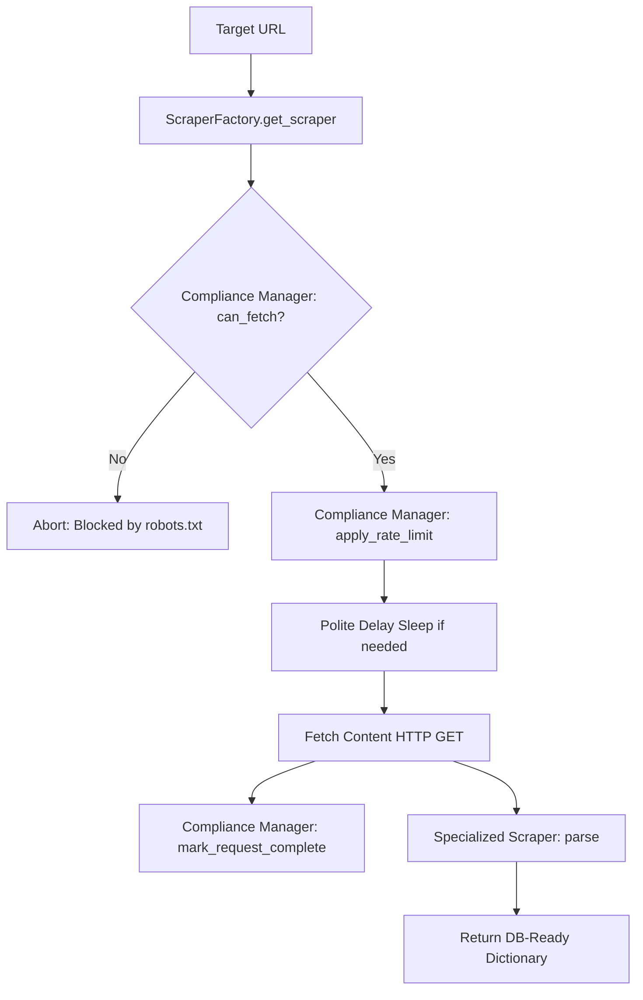

# Ethical Web Scraper Framework

A modular, extensible, and compliance-first Python web scraping framework designed to scrape web directories (such as support group meetings or grant databases) while strictly adhering to data privacy and host server directives.

---

## 🌟 Key Features

*   **Compliance-First Engine**: Dynamically fetches, parses, and obeys `robots.txt` directives per domain using Python's standard `urllib.robotparser`.
*   **Polite Rate Limiting**: Automatically honors host-specified crawl delays or falls back to a safe configuration limit, calculating exact sleep delays between subsequent requests.
*   **Object-Oriented & Modular Design**: Combines the **Factory Pattern** and **Template Method Pattern** to cleanly separate request compliance logic from domain-specific HTML parsing.
*   **Zero External Dependencies**: Implemented entirely using Python's standard library (`urllib`, `time`, `abc`, `json`), making it lightweight and highly portable.

---

## 🏗️ Architecture & Workflow

The framework follows a sequence where compliance and politeness are guaranteed before any HTTP requests are sent to the target host.



### Core Components

1.  **Configuration Layer (`CONFIG`)**: Centralizes the User-Agent identification (with admin contact details), default rate limits, and crawl delays.
2.  **`EthicalComplianceManager`**: Maintains an in-memory cache of `robots.txt` rules and tracking history of requests to dynamically apply backoffs per domain.
3.  **`BaseScraper` (Template Pattern)**: Outlines the workflow contract (`scrape()`), executing safety/delay steps first before invoking the abstract `parse()` method.
4.  **`ScraperFactory`**: A registry that dynamically maps target domains to specialized scraper classes using Python class decorators.
5.  **Specialized Scrapers (e.g., `WikipediaScraper`)**: Concrete implementations containing custom DOM extraction logic, returning unified records prepared for database ingestion.

---

## 📁 Project Structure

*   [Ethical_Web_Scraper.ipynb](./Ethical_Web_Scraper.ipynb): The main interactive notebook containing the framework implementation, modular code segments, and diagnostics blocks.
*   [test_run.py](./test_run.py): The production-ready standalone script version of the scraper that can be run directly from a terminal or integrated into background cron tasks.

---

## 🚀 Getting Started

### Prerequisites

Since the scraper relies solely on Python's standard library, no external packages (such as `requests` or `BeautifulSoup`) are required to run the basic pipeline.

*   Python 3.8+

### Running the Script

To run the compliance diagnostics and full scraping pipeline:

```bash
python test_run.py
```

### Running the Notebook

For interactive execution and debugging:

1.  Open your preferred notebook environment (Jupyter, VS Code, or Google Colab).
2.  Open [Ethical_Web_Scraper.ipynb](./Ethical_Web_Scraper.ipynb).
3.  Execute the cells sequentially to run the live test cases.

---

## 🛠️ Extending the Scraper

To add support for a new website, register a new subclass of `BaseScraper` using the `@ScraperFactory.register` decorator and implement the custom HTML parsing logic.

### Example: Adding a Grant Directory Scraper

```python
from typing import Dict, Any

@ScraperFactory.register('grants.example.gov')
class GrantScraper(BaseScraper):
    """
    Concrete scraper for extracting government grant listings.
    """
    def parse(self, html: str) -> Dict[str, Any]:
        # Implement your parsing logic (e.g., regex, html.find, or BeautifulSoup)
        # return a clean dictionary structured for SQL/NoSQL storage.
        return {
            "source_domain": "grants.example.gov",
            "extracted_data": "Custom grant data values extracted from HTML",
            "timestamp": time.time()
        }
```

Once registered, any call to `ScraperFactory.get_scraper("https://grants.example.gov/database", manager)` will automatically select and use your custom `GrantScraper`.

---

## 🛡️ Ethical Scrape Guidelines

1.  **Always Identify Your Bot**: Update the `USER_AGENT` field in `CONFIG` to point to your research organization or email address.
    ```python
    'USER_AGENT': 'MyEthicalBot/1.0 (+mailto:contact@myorganization.org)'
    ```
2.  **Respect Rate Limits**: Keep the fallback `DEFAULT_CRAWL_DELAY` at a conservative value (e.g., `3.0` to `5.0` seconds) to avoid stressing host systems.
3.  **Check robots.txt**: Never bypass pages disallowed by host servers.
4.  **Handle Private Data with Care**: When scraping sensitive targets, ensure any personally identifiable information (PII) is encrypted or discarded unless explicitly permitted.
